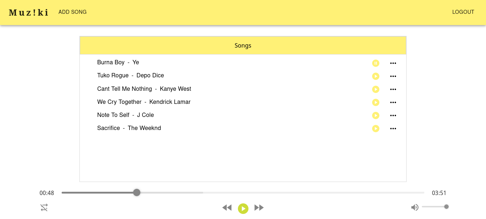

# Muz!ki

## Table of Content

- [Description](#description)
- [Screenshot](#screenshot)
- [Installation](#install-requirements)
- [Technology Used](#technology)
- [License](#license)
- [Authors Info](#authors-Info)

## Description

Muziki is a web-based application that allows users to easily upload and stream a wide selection of music tracks. The platform hosts an extensive and diverse music library curated from various sources, providing users with an unmatched selection of songs from various genres and artists. With the ability to log in to their accounts from different devices, users can enjoy their favorite tunes on-the-go, all while effortlessly managing their personal music libraries through Muziki's user-friendly interface.

## Screenshot

# 

## Install Requirements

- Computer

- Internet Access

- Git

- Terminal

- Npm

- Ruby

## Installation

On your computer open terminal and run:

    $ git clone https://github.com/qurriahSam/mziki.git

    $ cd mziki

    $ bundle install

    $ rails s

    $ npm install --prefix client

    $ npm start --prefix client

[Go Back to the top](#Muz!ki)

## Technology

- Material UI - Has been used for styling the navbar and other elements on the landingpage.

- ReactJS - Has been used to create components of the web app

- Ruby on Rails - Has been used for database and api creation

- AWS S3 - Has been used for cloud storage

- Heroku - App has been deployed on Heroku platform

## Links

- Live Site URL: [Muz!ki](https://muzeik.herokuapp.com/)

[Go Back to the top](#Muz!ki)

## License

[MIT](./LICENSE) License.

[Go Back to the top](#Muz!ki)

## Authors Info

Linked - [Sam Kuria](https://www.linkedin.com/in/sam-kuria-0904b01a1)

[Go Back to the top](#Muz!ki)
